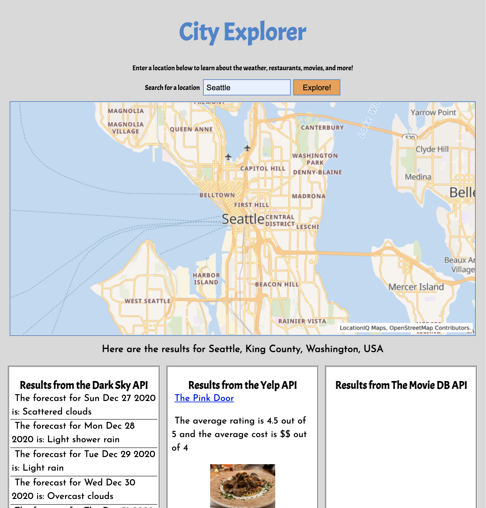

# city-explorer-api

**Author**: Haley Griffin
**Version**: 
- 1.0.0 - initialization
- 1.1.0 - test server created
- 1.2.0 - added function to handle errors
- 2.0.0 - refactored weather data format
- 2.1.0 - added a location api to get lat/lon locations
- 2.2.0 - added a weather api to get current weather for location entered
- 2.3.0 - added a trails api to get a list of local hikes for location entered
- 3.0.0 - added SQL database to save previous location queries
- 3.0.1 - installed pg dependencies, set up db framework
- 3.1.0 - initialized database, added schema.sql file
- 3.2.0 - populate database with data pulled from API
- 3.2.1 - added connection to db
- 3.2.2 - db connection successful, rendering to page
- **3.2.3 - deprecated APIs no longer working**

## links
heroku: https://city-explorer-api-griffin.herokuapp.com/

github: https://github.com/h-griffin/city-explorer-api

deployed: 

## Overview
The purpose of this application is to give the user an easy means of finding activities to do for a given city location. By entering a cty, the user will get a list of food options, movies and weather for that given area, making it easier to help plan trips.

This app was created as a Code Fellows 301 class project with the purpose of learning how to create and deploy back-end servers.

## Getting Started
To build this app yourself, here are the steps you need to take:

1. Make a github repository to store your work, clone that repo to local
2. Make requests for API keys for these services:
    - [LocationIQ](https://locationiq.com/)
    - [Yelp](https://www.yelp.com/developers/documentation/v3/business_search)
    - [The Movie DB](https://developers.themoviedb.org/3/getting-started/introduction)
    - [Weather](https://www.weatherbit.io/account/login)
    - [Trails (no longer available)](https://www.hikingproject.com/data)
3. Setup a a [Trello](https://trello.com/en-US) board or some other workflow assistance tool
4. Setup a server for the app's backend: [PostgreSQL DB Setup](https://codefellows.github.io/code-301-guide/curriculum/class-08/cheatsheets/postgres-shell)
5. Deploy the server using [Heroku](https://www.heroku.com/)

## Architecture
This project was built with:

- Node.js
- cors
- Express
- dotenv
- superagent
- postgreSQL 
